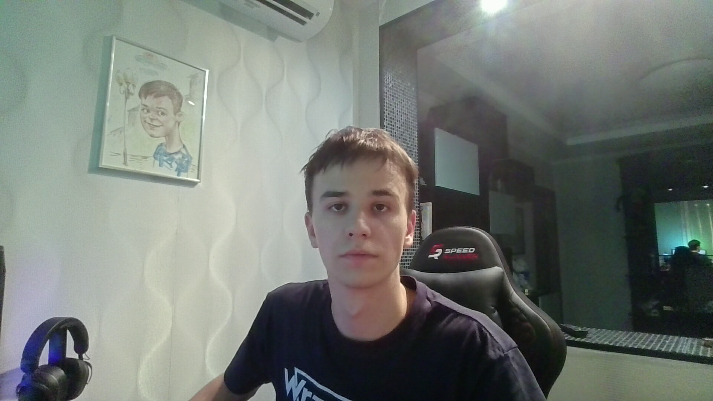
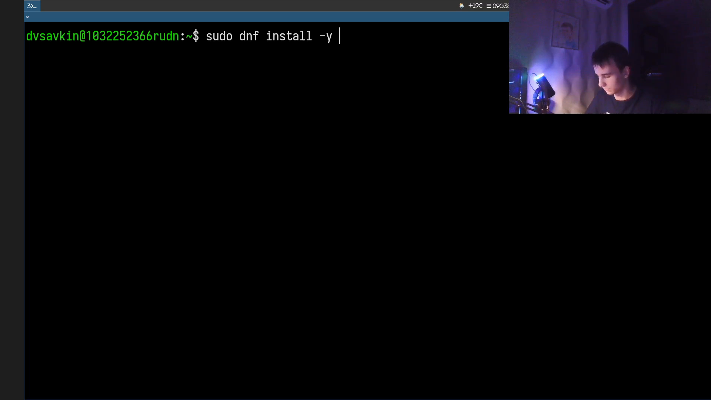
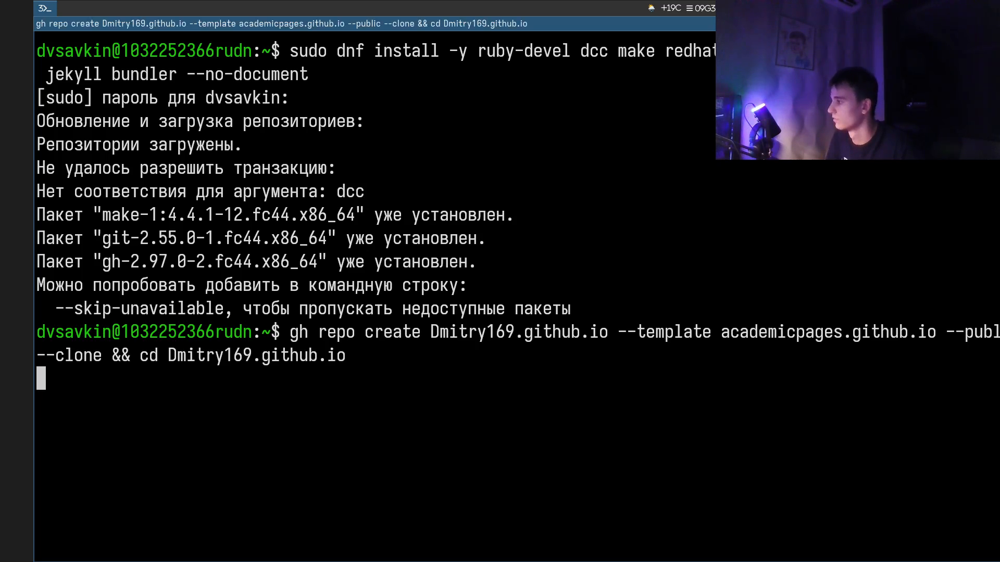
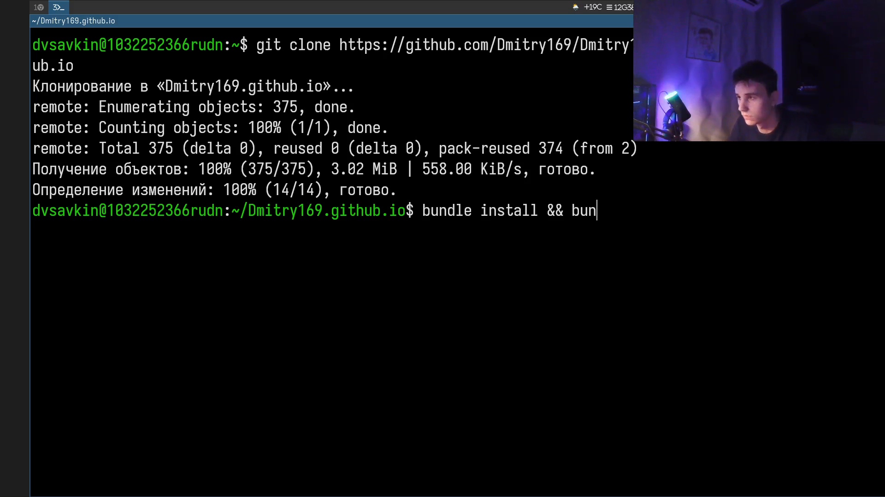
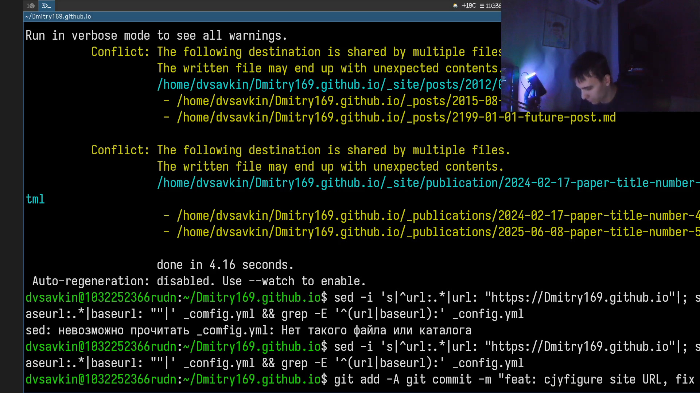
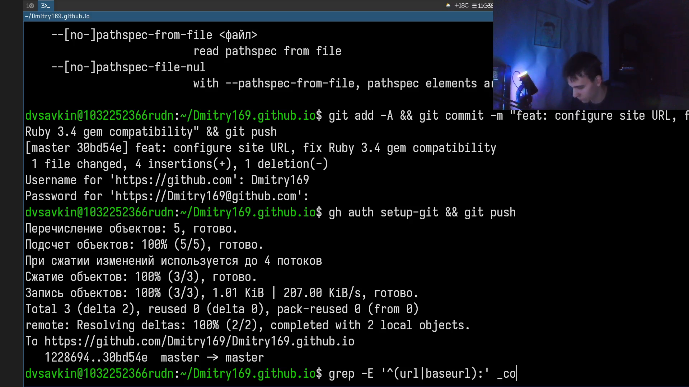
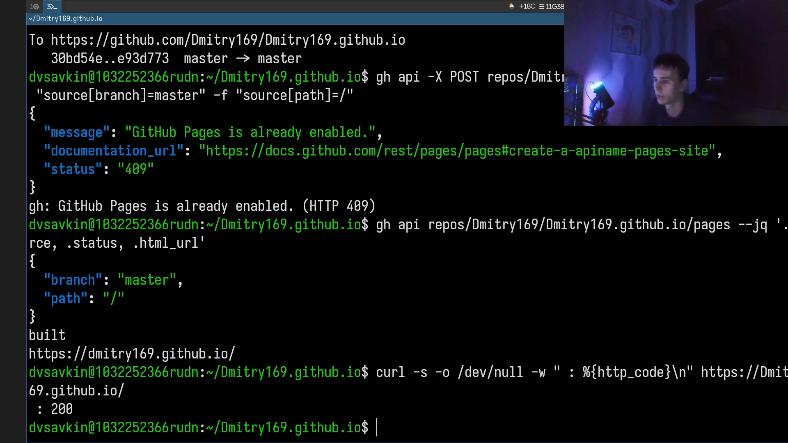

# Информация

## Докладчик

:::::::::::::: {.columns align=center}
::: {.column width="70%"}

- Савкин Дмитрий Вадимович
- РУДН, группа НПИбд-02-25
- Тема: индивидуальный проект — Этап 1

:::
::: {.column width="30%"}

:::
::::::::::::::

# Цель работы

Разместить на GitHub Pages заготовку персонального академического сайта.

# Задание

- Установить необходимое программное обеспечение
- Скачать шаблон темы сайта
- Разместить его на хостинге git
- Установить параметр для URL сайта
- Разместить заготовку сайта на GitHub Pages

# Выполнение проекта

## Установка программного обеспечения

Устанавливаю Ruby, Bundler и зависимости темы через `dnf install`.

{width=70%}

## Создание репозитория

Создаю репозиторий `Dmitry169.github.io` на основе шаблона academicpages командой `gh repo create`.

{width=70%}

## Установка зависимостей темы

Клонирую шаблон и устанавливаю зависимости Jekyll через `bundle install`.

{width=70%}

## Настройка URL и сборка

Настраиваю `url`/`baseurl` в `_config.yml` и собираю сайт через `bundle exec jekyll build`.

{width=70%}

## Публикация изменений

Коммичу изменения и отправляю их на GitHub командой `git push`.

{width=70%}

## Результат

Включаю публикацию через GitHub Pages, проверяю доступность сайта командой `curl` (код 200).

{width=70%}

# Выводы

- Установлено необходимое программное обеспечение (Ruby, Bundler, Jekyll)
- Развёрнут шаблон темы academicpages
- Настроен параметр URL сайта
- Заготовка сайта опубликована на GitHub Pages
