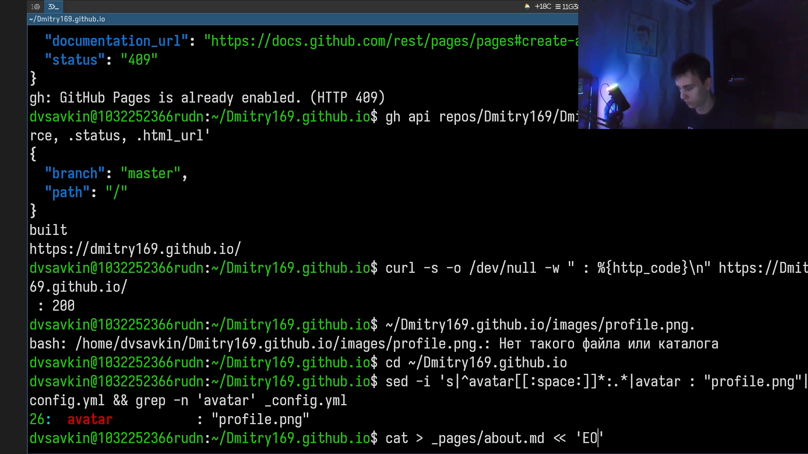
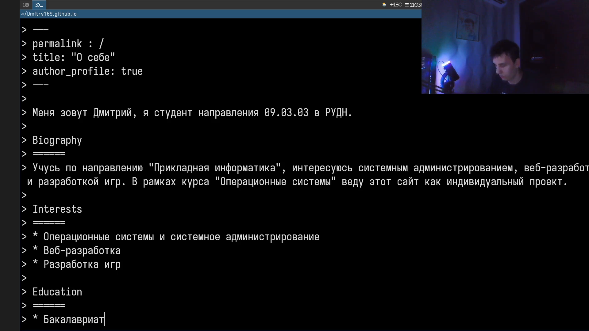
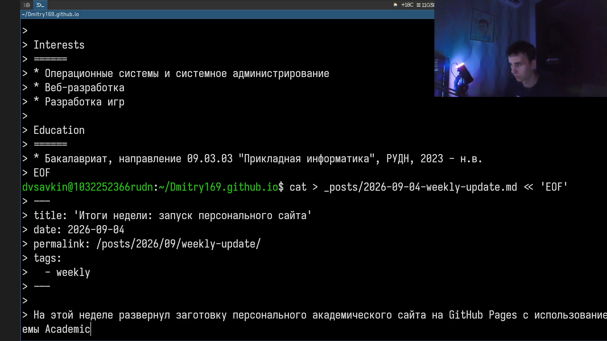
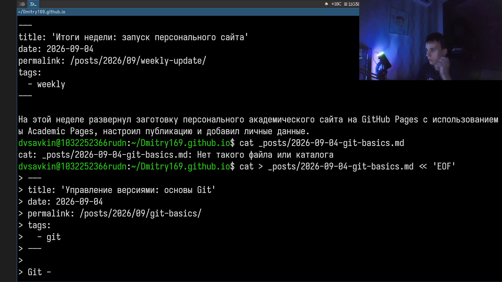
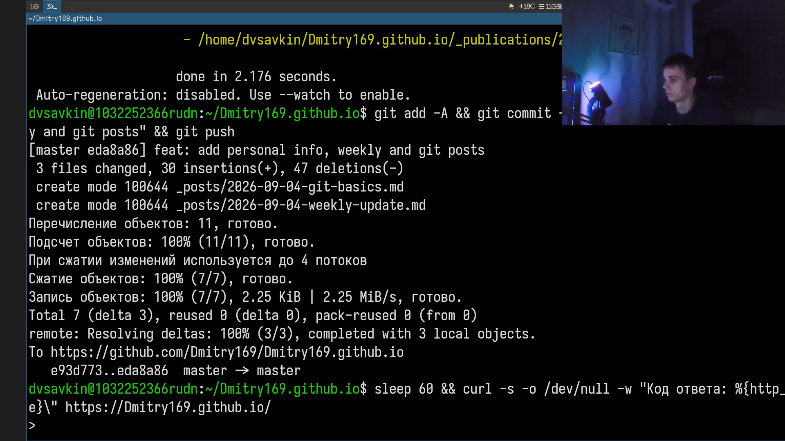

# Информация

## Докладчик

:::::::::::::: {.columns align=center}
::: {.column width="70%"}

- Савкин Дмитрий Вадимович
- РУДН, группа НПИбд-02-25
- Тема: индивидуальный проект — Этап 2

:::
::: {.column width="30%"}

:::
::::::::::::::

# Цель работы

Добавить на персональный сайт данные о себе.

# Задание

- Разместить фотографию владельца сайта
- Разместить краткое описание владельца сайта (Biography)
- Добавить информацию об интересах (Interests)
- Добавить информацию об образовании (Education)
- Сделать пост по прошедшей неделе
- Добавить пост на тему по выбору: Git

# Выполнение проекта

## Фотография и начало Biography

Размещаю фотографию владельца сайта и начинаю заполнять `about.md` разделом Biography.

{width=70%}

## Interests и Education

Дополняю `about.md` разделами Interests и Education.

{width=70%}

## Завершение about.md и weekly-update

Завершаю `about.md` и начинаю пост о прошедшей неделе.

{width=70%}

## Пост на тему по выбору

Пишу пост `git-basics.md` — тема по выбору «Управление версиями (Git)».

{width=70%}

## Публикация изменений

Собираю сайт, коммичу и отправляю изменения на GitHub.

{width=70%}

# Выводы

- Добавлена фотография и биография владельца сайта
- Заполнены разделы Interests и Education
- Опубликован пост по прошедшей неделе
- Опубликован пост на тему «Управление версиями (Git)»
