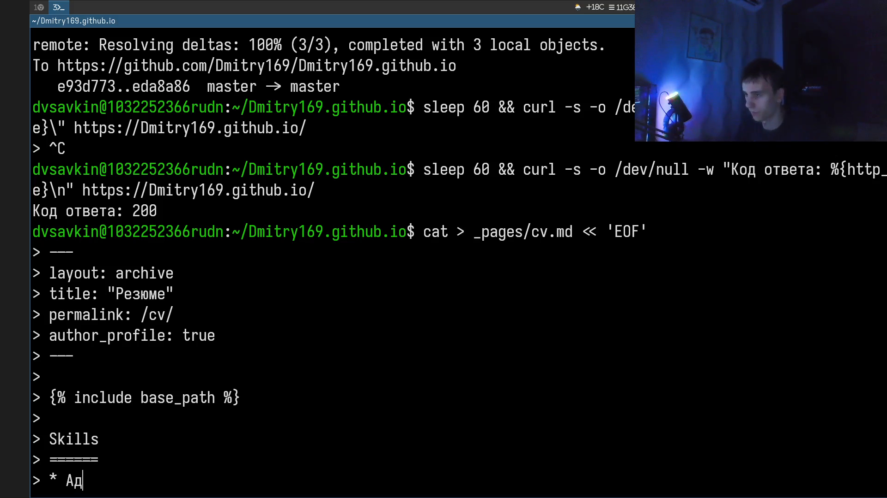
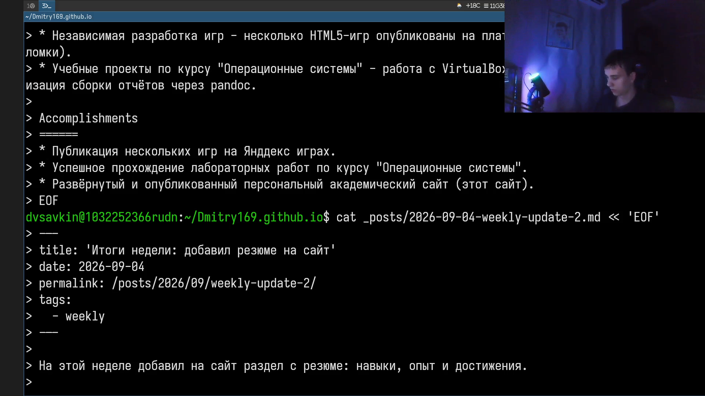
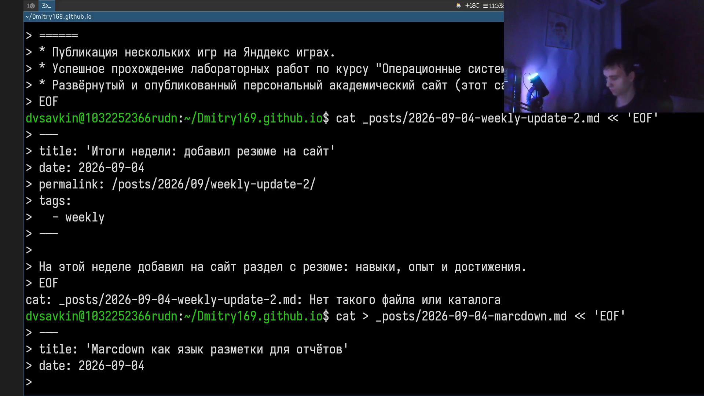
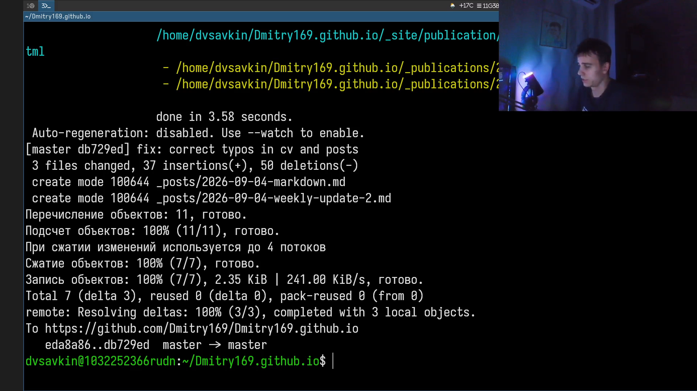

# Информация

## Докладчик

:::::::::::::: {.columns align=center}
::: {.column width="70%"}

- Савкин Дмитрий Вадимович
- РУДН, группа НПИбд-02-25
- Тема: индивидуальный проект — Этап 3

:::
::: {.column width="30%"}

:::
::::::::::::::

# Цель работы

Добавить на персональный сайт информацию о достижениях.

# Задание

- Добавить информацию о навыках (Skills)
- Добавить информацию об опыте (Experience)
- Добавить информацию о достижениях (Accomplishments)
- Сделать пост по прошедшей неделе
- Добавить пост на тему по выбору: Markdown

# Выполнение проекта

## Skills, Experience, Accomplishments

Создаю `cv.md` с разделами Skills, Experience и Accomplishments.

{width=70%}

## Пост по прошедшей неделе

Пишу второй пост о прошедшей неделе.

{width=70%}

## Пост на тему по выбору

Пишу пост `markdown.md` — тема по выбору «Markdown».

{width=70%}

## Публикация изменений

Коммичу и отправляю изменения на GitHub.

{width=70%}

# Выводы

- Добавлены разделы Skills, Experience и Accomplishments в CV
- Опубликован пост по прошедшей неделе
- Опубликован пост на тему «Markdown»
