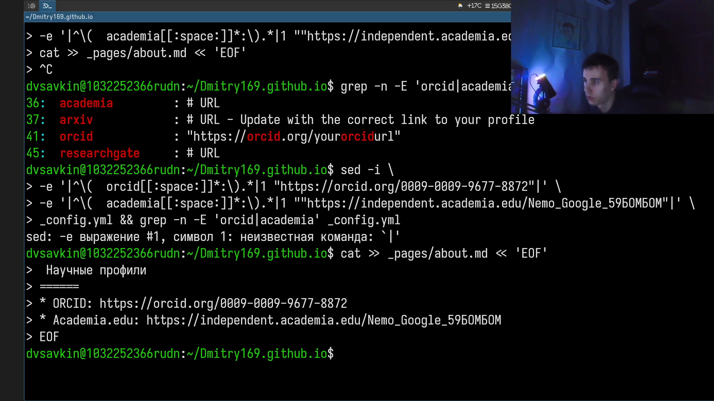
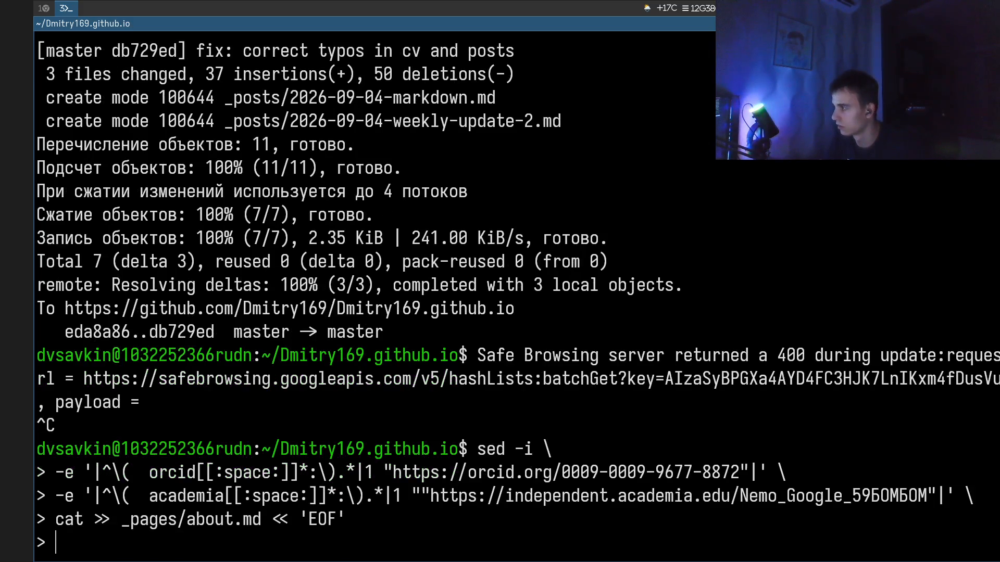
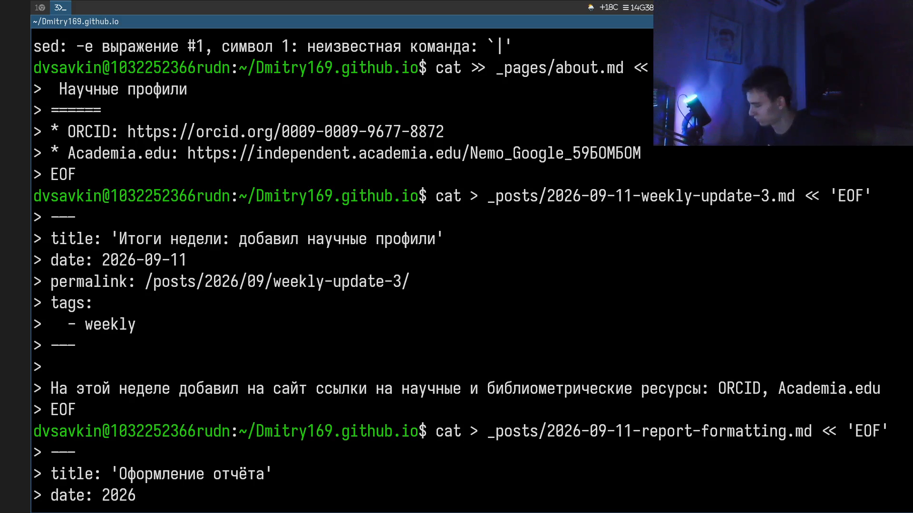
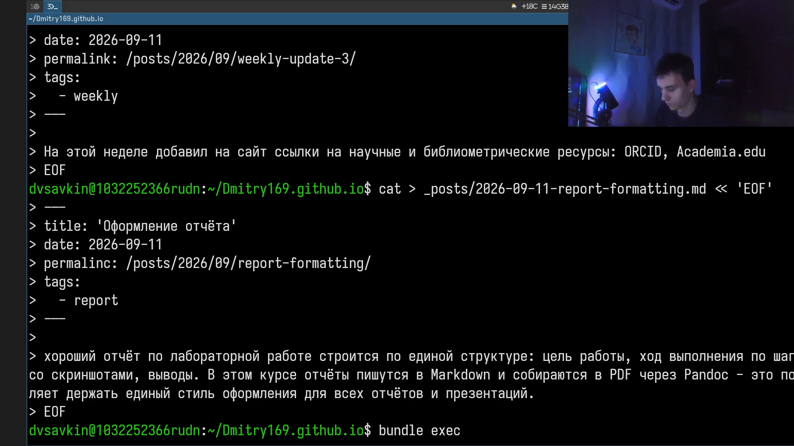
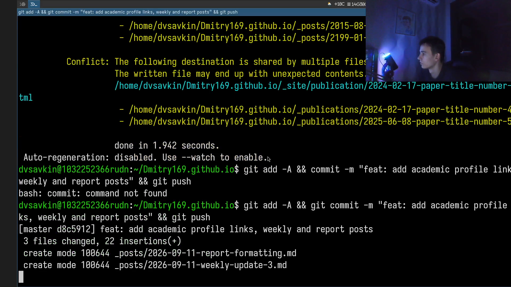

# Информация

## Докладчик

:::::::::::::: {.columns align=center}
::: {.column width="70%"}

- Савкин Дмитрий Вадимович
- РУДН, группа НПИбд-02-25
- Тема: индивидуальный проект — Этап 4

:::
::: {.column width="30%"}

:::
::::::::::::::

# Цель работы

Добавить на персональный сайт ссылки на научные и библиометрические ресурсы.

# Задание

- Зарегистрироваться и разместить ссылки: eLibrary, Google Scholar, ORCID, Mendeley, ResearchGate, Academia.edu, arXiv, GitHub
- Сделать пост по прошедшей неделе
- Добавить пост на тему по выбору: Оформление отчёта

# Выполнение проекта

## Научные профили

Регистрируюсь в научных сервисах и добавляю ссылки (ORCID, Academia.edu и другие) в `about.md`.

{width=70%}

## Ссылки в конфигурации сайта

Добавляю ссылки на профили в `_config.yml`.

{width=70%}

## Пост по прошедшей неделе

Пишу пост о прошедшей неделе и начинаю пост на тему по выбору.

{width=70%}

## Пост на тему по выбору

Пишу пост `report-formatting.md` — тема по выбору «Оформление отчёта» — и собираю сайт.

{width=70%}

## Публикация изменений

Коммичу и отправляю изменения на GitHub.

{width=70%}

# Выводы

- Добавлены ссылки на научные и библиометрические ресурсы
- Опубликован пост по прошедшей неделе
- Опубликован пост на тему «Оформление отчёта»
