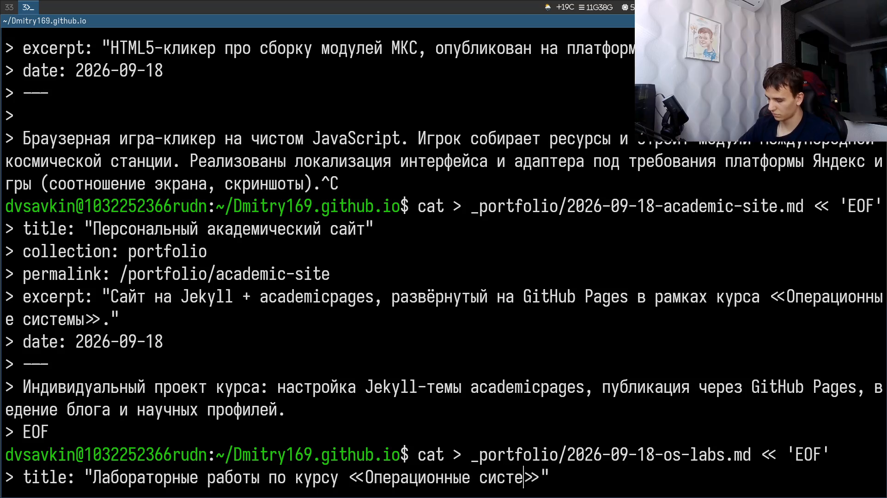

# Информация

## Докладчик

:::::::::::::: {.columns align=center}
::: {.column width="70%"}

- Савкин Дмитрий Вадимович
- РУДН, группа НПИбд-02-25
- Тема: индивидуальный проект — Этап 5

:::
::: {.column width="30%"}

:::
::::::::::::::

# Цель работы

Добавить на персональный сайт оставшиеся элементы.

# Задание

- Сделать записи для персональных проектов
- Сделать пост по прошедшей неделе
- Добавить пост на тему по выбору: Языки научного программирования

# Выполнение проекта

## Персональные проекты

Добавляю записи о персональных проектах: сайт и лабораторные работы по курсу ОС.

{width=70%}

## Правка содержимого

Исправляю содержимое одной из записей и пересобираю сайт.

{width=70%}

## Пост по прошедшей неделе

Пишу пост о прошедшей неделе и начинаю пост на тему по выбору.

{width=70%}

## Пост на тему по выбору

Пишу пост `scientific-languages.md` — тема по выбору «Языки научного программирования».

{width=70%}

## Публикация изменений

Коммичу и отправляю изменения на GitHub.

{width=70%}

# Выводы

- Добавлены записи о персональных проектах
- Опубликован пост по прошедшей неделе
- Опубликован пост на тему «Языки научного программирования»
