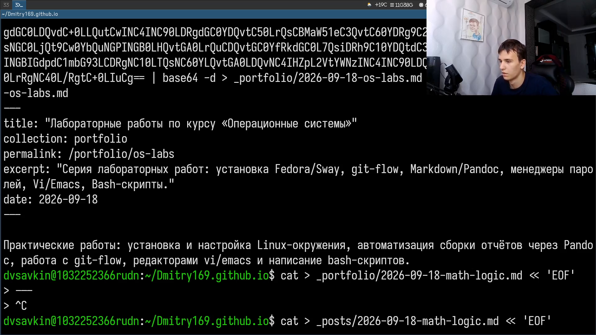
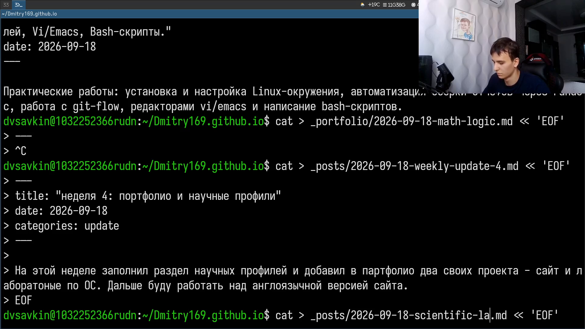
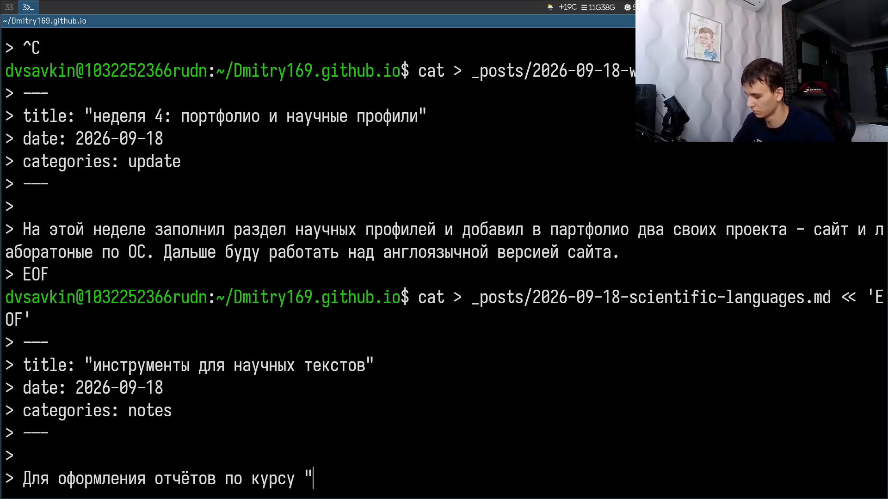
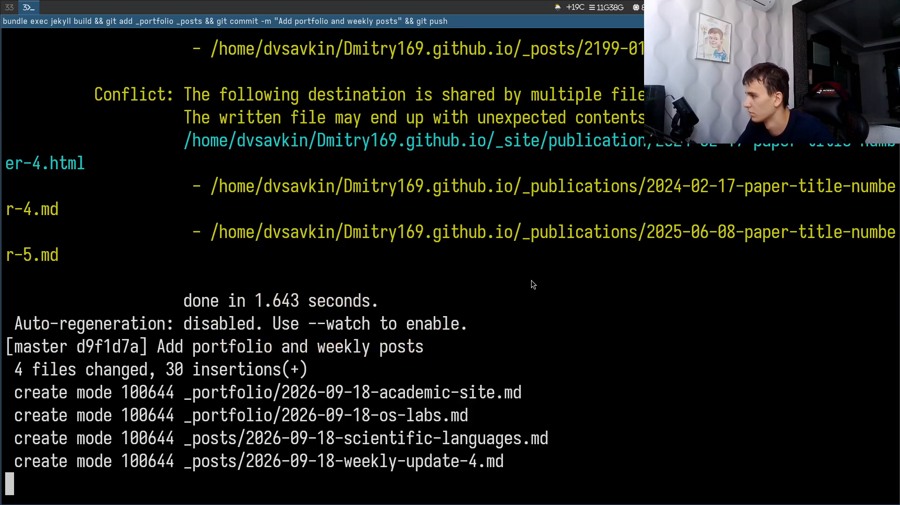

---
author:
  name: Савкин Дмитрий Вадимович
  affiliation:
    - name: Российский университет дружбы народов
      country: Российская федерация
      city: Москва
title: "Отчёт по индивидуальному проекту. Этап 5"
subtitle: "Добавление остальных элементов сайта"
license: "CC BY"
---

# Цель работы

Добавить на персональный сайт оставшиеся элементы.

# Задание

- Сделать записи для персональных проектов
- Сделать пост по прошедшей неделе
- Добавить пост на тему по выбору: Языки научного программирования

# Выполнение проекта

Добавляю записи о персональных проектах: сайт и лабораторные работы по курсу операционных систем.

{width=70%}

Исправляю содержимое одной из записей и пересобираю сайт.

{width=70%}

Пишу пост о прошедшей неделе и начинаю пост на тему по выбору.

{width=70%}

Пишу пост `scientific-languages.md` — тема по выбору «Языки научного программирования».

{width=70%}

Коммичу и отправляю изменения на GitHub.

{width=70%}

# Выводы

Добавлены записи о персональных проектах, опубликован пост по прошедшей неделе и пост на тему «Языки научного программирования».
