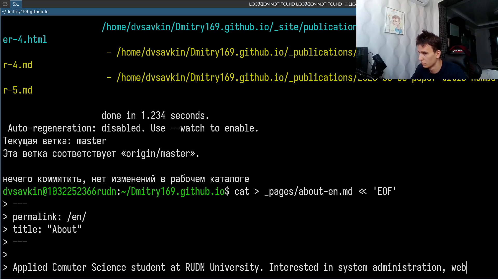
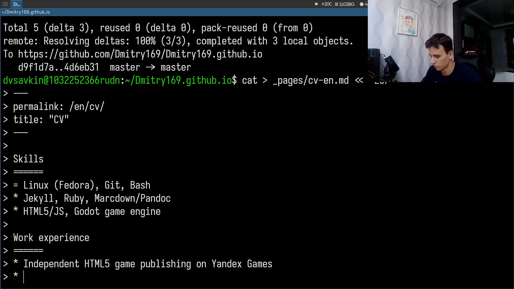
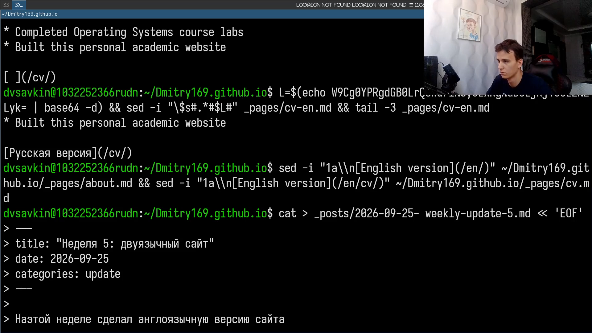
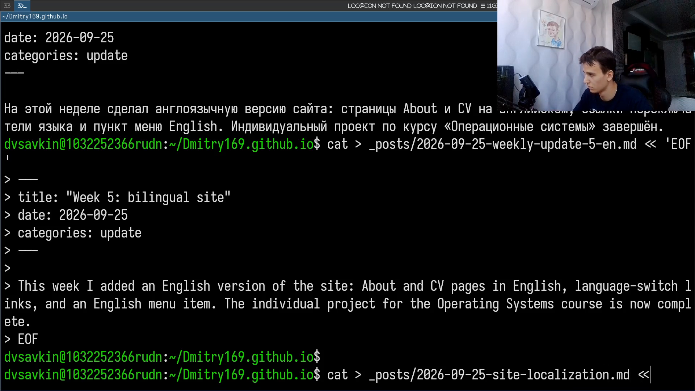
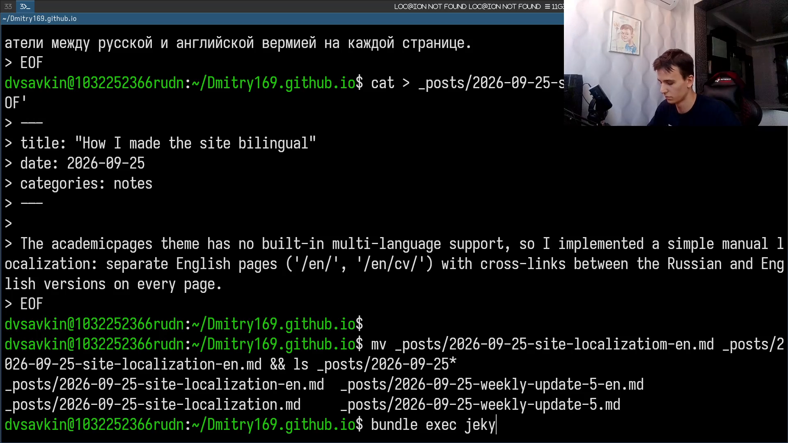
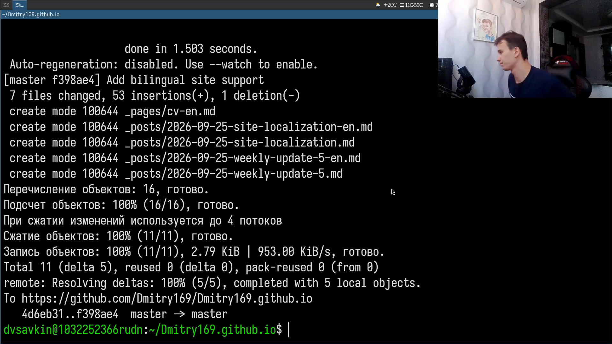

# Информация

## Докладчик

:::::::::::::: {.columns align=center}
::: {.column width="70%"}

- Савкин Дмитрий Вадимович
- РУДН, группа НПИбд-02-25
- Тема: индивидуальный проект — Этап 6

:::
::: {.column width="30%"}

:::
::::::::::::::

# Цель работы

Разместить двуязычный (русский и английский) персональный сайт на GitHub.

# Задание

- Сделать поддержку английского и русского языков
- Разместить элементы сайта на обоих языках
- Разместить контент на обоих языках
- Сделать пост по прошедшей неделе
- Добавить пост на тему по выбору (на двух языках)

# Выполнение проекта

## Страница About на английском

Создаю англоязычную страницу `about-en.md`.

{width=70%}

## Страница CV на английском

Создаю англоязычную страницу `cv-en.md`.

{width=70%}

## Переключатели языков и пункт меню

Добавляю перекрёстные ссылки между русской и английской версиями страниц и пункт меню English.

{width=70%}

## Посты по прошедшей неделе

Пишу пост о прошедшей неделе на русском и английском языках.

{width=70%}

## Пост на тему по выбору

Пишу пост о локализации сайта на русском и английском языках и собираю сайт.

{width=70%}

## Публикация изменений

Коммичу и отправляю изменения на GitHub — индивидуальный проект завершён.

{width=70%}

# Выводы

- Добавлена англоязычная версия страниц About и CV
- Настроены переключатели языков и пункт меню English
- Опубликованы посты по прошедшей неделе и на тему по выбору на двух языках
- Двуязычный сайт опубликован на GitHub Pages
